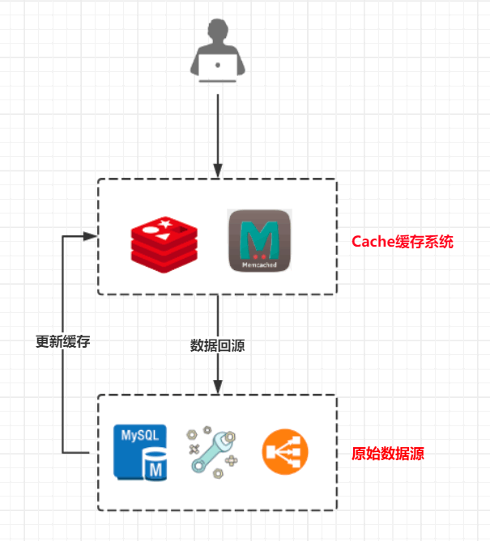
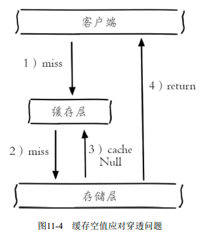
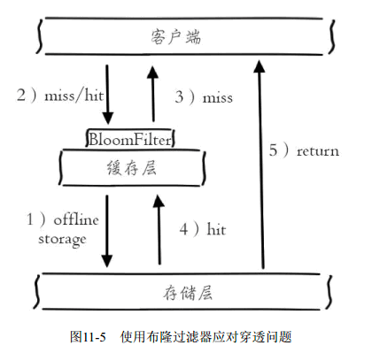

# 缓存系统中面临的雪崩/穿透/一致性问题
缓存系统一定程度上极大提升系统并发能力，但同样也增加额外技术考虑因素，下面针对缓存系统设计与使用中面临的常见问题展开。

- 缓存应用的典型场景
- 缓存雪崩
- 缓存穿透
- 缓存更新与数据一致性

## 缓存应用的典型场景

请求->缓存->命中缓存则返回数据->无缓存则读取原始数据源

- 缓存定位：前置数据加载，避免数据回源，提供高性能、高并发的数据读取能力；只有未命中缓存时才进行数据回源，极大减轻原始数据读取的压力

- 缓存分类：按缓存系统所处位置不同，分为本地缓存、分布式缓存

- - 本地缓存：内存级缓存、文件级缓存，内存级缓存优势在于本地内存I/O、高性能(单次内存寻址100ns)，缺点在于空间有限，无法多端数据同步，此类方案有PHP的Opcache/Yac, Java中Encache/GuavaCache/SpringCache等；文件级缓存依赖磁盘I/O实现缓存作用，受机械磁盘寻道性能限制(单次磁盘读取时间10ms左右)，或考虑固态硬盘/Raid优化方案，较少使用
- - 分布式缓存：Memcached、Redis等，分布式系统解决缓存容量问题，具备持续扩容能力，但不可避免一次网络I/O请求
本文主要讨论分布式缓存系统设计与使用中面临的问题。

## 缓存雪崩
*定义*：缓存雪崩是指缓存系统失效，导致大量请求同时进行数据回源，导致数据源压力骤增而崩溃。两种情况会导致此问题：
1. 多个缓存数据同时失效；
2. 缓存系统崩溃

### 缓存同时失效
- 在大量缓存同时失效的情况下，请求回源，导致数据源请求暴增而崩溃，系统全局不可用
- 缓存时间设置原则：根据缓存数据访问规律和缓存数据不一致的敏感性要求来选择缓存时间
- 缓存数据访问规律：如不同缓存数据访问无规律或相对离散，则不会存在这些缓存数据同时失效的情况；如缓存数据为批量写入(定时任务预热)，应考虑将缓存时间离散化，避免同时失效的情况下大量回源请求
- 缓存数据不一致的敏感性：不同应用场景下对缓存数据的一致性要求不同，缓存时间的设置视情况而定
- 这里也涉及到缓存更新策略问题，错误的更新策略可能会先删除缓存，再设置缓存，此时间差范围内的请求会进行回源，会导致此问题
> 如何避免应考虑：缓存失效时间离散化
### 缓存系统故障
缓存系统整体故障，则整个缓存系统不可用，大量回源请求，且由于缓存系统故障无法回写缓存，导致无法快速恢复。

一句老话：为解决一个问题，引入新的解决方案，同时也必然引入新的问题。

这也是缓存系统的引入，在解决高性能、高并发的同时，引入了新的故障点。

考虑此问题，应从事前、事故中、事后不同阶段考虑：
- 事前：增加缓存系统高可用方案设计，避免出现系统性故障
- 事故中：
- - 增加多级缓存，在单一缓存故障时，仍有其他缓存系统可用，如之前项目中使用的三级缓存方案：内存级缓存->Memcached->Redis这样的方案；
- - 启用熔断限流机制，只允许可承受流量，避免全部流量压垮系统
- 事后：缓存数据持久化，在故障后快速恢复缓存系统
## 缓存穿透
定义：**缓存穿透是指访问不存在数据，从而绕过缓存，直取数据源（大量数据源读取操作）**

解决缓存穿透的思路：
- 不存在资源访问时，在缓存系统设置空值来拦截
- - - 优点：实现简单
- - - 问题：大量非法请求时，缓存系统被填充大量非法值

- 根据资源设置拦截机制（布隆过滤器bloomfilter或压缩filter过滤有效资源，如有效用户id等；也可以全局保存有效资源摘要，专用过滤、防穿透）
- - - 优点：缓存系统空间利用较好
- - - 问题：过滤器实现机制和数据一致性要求

## 缓存更新与数据一致性
缓存系统数据的更新策略是需要专门开题来说的，建议阅读[左耳朵耗子：缓存更新的套路](https://coolshell.cn/articles/17416.html)系统了解，这里只根据实际经验给出在不同一致性要求下的建议。

一种常见缓存更新策略（此方案有问题）：

- 读操作：命中缓存则返回，无缓存则取回源数据，写缓存
- 写操作：先删除缓存，再更新数据源

问题场景：读写并发的场景下先删缓存操作可能导致脏数据入缓存
- 写操作：删除缓存
- 读操作：无缓存则取回源数据（旧数据），回写缓存（此时缓存中为旧数据）
- 写操作：更新数据源
- 此时缓存数据不一致：缓存中为旧数据，数据源为新数据，出现缓存旧数据问题

### 几种更新缓存的策略：
- Cache Aside Pattern：缓存失效时回源取数据，更新缓存；命中缓存时，返回缓存数据；先数据源更新后，再失效缓存（由等待下次读取来回写缓存）
- - 优势：无缓存旧数据问题、缓存系统维护简单、Facebook推荐方案
- - 问题：无法绝对杜绝并发读写问题
- - - 缓存过期的背景下，读操作回源取数据（此时为旧数据）
- - - 写操作：更新数据源，失效缓存
- - - 读操作：将回源数据（旧数据）写缓存，出现缓存数据不一致问题
- - - 这种问题出现概率极低，几点要求：缓存已过期、并发读写、读数据比写数据快、但读操作更新缓存比写操作失效缓存慢（也就是说写操作的行为需完全发生在读操作两步之间），一般而言读操作（读库+更新缓存）时长要小于写操作（更新数据源+失效缓存），所以认为这种并发问题概率较低
- - - 是否可进一步解决此问题：增加锁机制，解决并发问题
- Read Through Pattern：更新数据源由缓存系统操作
- - 读取数据时，如缓存失效，则缓存服务取回源数据更新缓存
- - 而Cache Aside中是由应用服务（调用方）更新缓存
- - 这套对调用方是透明的，只有一套存储系统，而无视缓存、数据源的差异
- Write Through Pattern：更新数据源由缓存系统操作
- - 写数据时，如缓存失效，则直接更新数据源（不做任何缓存操作）；如命中缓存，则更新缓存（由缓存系统更新数据源）
- - 在缓存失效下写操作的处理后，何时更新缓存呢？下一次读操作，按Read Through中缓存失效策略来更新缓存
- Write Behind Caching Pattern：又称Write Back
- - 一句话总结：更新数据时，只更新缓存，不更新数据源（缓存异步批量更新数据源）
- - 优势：
- - - 更新缓存为内存操作，读写I/O非常高
- - - 异步批量更新数据源，合并多个操作
- - 问题：
- - - 缓存不满足强一致性要求
- - - 强一致性和高性能的冲突、高可用和高性能的冲突终究会使Trade-Off
- - - 实现复杂，需跟踪哪些Cache更新，成本较高
总体来说，不同方案在不同场景下是有各自优劣的，技术选型、架构设计应根据实际场景取舍，并对选择方案的利弊有足够且深入理解。

一般而言，推荐Cache Aside Pattern方案，容忍较小概率的不一致（同时也可以增加锁机制解决此低概率并发问题），简化缓存系统复杂度。

原文链接：http://fivezh.github.io/2019/02/11/cache-things/
